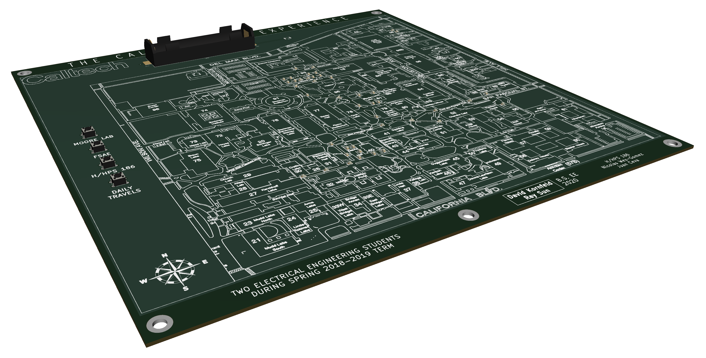

# caltech-h186-map

This is a PCB map of part of the Caltech campus designed for the final project of H/HPS 186: From Plato to Pluto: Maps, Exploration and Culture from Antiquity to the Present.

## Contributors
- __Image processing:__    David Kornfeld, B.S. EE 2020
- __PCB design:__              Ray Sun, B.S. EE 2020
